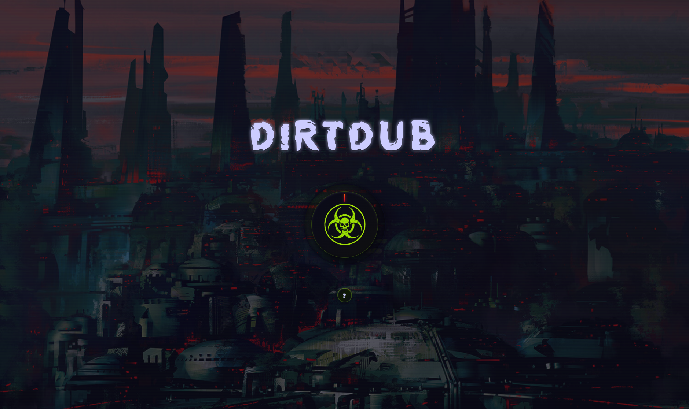

# D!RTDUB

**One-knob audio degradation tool for underground musicians**

  

Progressive audio destruction through bitcrushing, filtering, distortion, dropouts, and pitch warping. Turn the knob, watch your audio deteriorate.

 

[**🎮 Try It Live**](https://bxavaby.github.io/dirtdub)

 

---

## Features

- **Single knob control** → 0% clean to 100% destroyed
- **Real-time processing** → Web Audio API + custom worklets
- **Auto-looping** → Short samples loop automatically
- **Responsive design** → Works on all devices
- **Zero latency** → No installation required

## Effects

- Bitcrushing (16→6 bit)
- Sample rate reduction (44kHz→8kHz)
- Analog distortion
- High/low pass filtering
- Random dropouts
- Pitch modulation
- Pink noise injection

 

#

**Compatible:** Chrome 66+, Firefox 76+, Safari 14.1+, Edge 79+

**Formats:** WAV, MP3, OGG, FLAC, M4A

